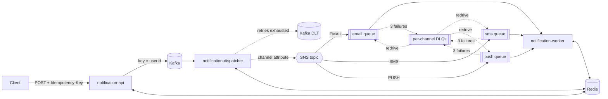

# Distributed Notification Service

[](https://github.com/YOUR_GITHUB_USERNAME/distributed-notification-service/actions/workflows/ci.yml)
[](LICENSE)


A microservices-based notification platform that delivers email, SMS and push notifications
asynchronously using **Kafka** and **AWS SNS/SQS**, with **Redis-backed idempotency** to prevent
duplicate delivery and **dead-letter queues** for failure isolation and recovery.

Built with Java 17, Spring Boot 3, Spring Kafka and Spring Cloud AWS. Runs entirely on your machine
with Docker (LocalStack emulates SNS/SQS).

## Features

- **Asynchronous event delivery across distributed services** — an API, a dispatcher and a worker
  connected by a Kafka ingestion log and SNS → SQS fan-out with per-channel routing.
- **Redis-backed idempotency** — client `Idempotency-Key` deduplication at the API, plus a
  lease-based delivery guard (`SET NX` + Lua compare-and-delete) so each notification is sent once,
  even when messages are redelivered or reprocessed.
- **Retry handling** — exponential backoff with jitter in both the dispatcher (Kafka) and the worker
  (SQS visibility timeout); non-retryable errors are fast-tracked.
- **Dead-letter queues and failure recovery** — one SQS DLQ per channel, a Kafka DLT for dispatch
  failures, and an admin endpoint to redrive dead-lettered messages once the root cause is fixed.
- **Consistent status tracking** — an atomic state machine in Redis that cannot move backwards under
  concurrent updates.
- **Observability** — status API, delivery-outcome metrics, DLQ depth endpoint.

## Architecture



| Module | Responsibility |
|---|---|
| [`notification-common`](notification-common) | Event model, Redis key layout, status state machine |
| [`notification-api`](notification-api) | REST API, validation, client idempotency, Kafka producer |
| [`notification-dispatcher`](notification-dispatcher) | Kafka consumer, SNS publisher, retry + DLT |
| [`notification-worker`](notification-worker) | SQS consumer, idempotent delivery, backoff, DLQ redrive |

See **[docs/DESIGN.md](docs/DESIGN.md)** for the full design and
**[docs/CODE_WALKTHROUGH.md](docs/CODE_WALKTHROUGH.md)** for a guided tour of the code.

## Quick start

**Prerequisites:** Docker with Compose v2. For local development also JDK 17 or 21 (JDK 24+ is not supported by the test tooling), Maven 3.9+ and `jq`.

> macOS/Homebrew tip: `brew install maven` pulls in the newest JDK. Point Maven at JDK 17 with
> `export JAVA_HOME=/opt/homebrew/opt/openjdk@17/libexec/openjdk.jdk/Contents/Home` and check `mvn -version`.

### Option A — everything in Docker

```bash
git clone https://github.com/YOUR_GITHUB_USERNAME/distributed-notification-service.git
cd distributed-notification-service
SIMULATED_FAILURE_RATE=0 docker compose --profile apps up -d --build --wait
./scripts/e2e-test.sh
```

### Option B — services on the host (best for debugging)

```bash
make infra                              # Kafka, Redis, LocalStack
make build                              # compile + unit tests
SIMULATED_FAILURE_RATE=0 make run       # start api :8080, dispatcher :8081, worker :8082
make e2e                                # end-to-end checks
make stop && make down                  # clean up
```

Run `make help` for all targets. Kafka UI is available via `make tools` → http://localhost:8090.

## Usage

### Send a notification

```bash
curl -i -X POST http://localhost:8080/api/v1/notifications \
  -H 'Content-Type: application/json' \
  -H 'Idempotency-Key: order-123-shipped' \
  -d '{"userId":"u-1001","channel":"EMAIL","subject":"Shipped","body":"Your order is on the way"}'
```

```http
HTTP/1.1 202 Accepted
Location: /api/v1/notifications/5f0c…

{"notificationId":"5f0c…","result":"ACCEPTED"}
```

Sending the same request again with the same `Idempotency-Key` returns `200 OK` with the same
`notificationId` and `"result":"DUPLICATE_REQUEST"`; nothing is published twice.

### Check status

```bash
curl http://localhost:8080/api/v1/notifications/5f0c…
```

```json
{"attempts":"1","channel":"EMAIL","createdAt":"…","notificationId":"5f0c…","status":"SENT","updatedAt":"…","userId":"u-1001"}
```

Status values: `ACCEPTED → DISPATCHED → RETRYING → SENT`, or `… → DEAD_LETTERED → REDRIVEN → …`.

### Simulate failures and recover

```bash
# Always fails: retried 3 times with backoff, then moved to the SMS DLQ
curl -X POST http://localhost:8080/api/v1/notifications -H 'Content-Type: application/json' \
  -d '{"userId":"u-2002","channel":"SMS","body":"[FAIL_ALWAYS] code 123456"}'

curl http://localhost:8082/admin/dlq/SMS                         # DLQ depth
curl -X POST 'http://localhost:8082/admin/dlq/SMS/redrive?max=10' # move messages back to the queue
```

Set `SIMULATED_FAILURE_RATE` (0.0–1.0, default 0.2) on the worker to inject random transient failures.

### Endpoints

| Service | Method & path | Description |
|---|---|---|
| api | `POST /api/v1/notifications` | Create a notification (optional `Idempotency-Key` header) |
| api | `GET /api/v1/notifications/{id}` | Current status, attempts, last error |
| worker | `GET /admin/dlq/{channel}` | DLQ depth for `EMAIL`, `SMS` or `PUSH` |
| worker | `POST /admin/dlq/{channel}/redrive?max=N` | Move up to N messages back to the source queue |
| worker | `GET /actuator/metrics/notification.delivery` | Delivery outcomes by `channel` and `outcome` |
| all | `GET /actuator/health` | Health check |

## Testing

- **Unit tests** (`mvn verify`) cover idempotency outcomes, lease release, retry/backoff decisions,
  final-attempt dead-lettering, API replay/rollback and dispatcher behavior.
- **End-to-end tests** (`scripts/e2e-test.sh`) run against real Kafka, Redis and LocalStack and assert:
  happy-path delivery, API idempotent replay, suppression of an injected duplicate SQS message,
  retry → DLQ after exactly 3 attempts, DLQ redrive, and request validation.

Both run in [GitHub Actions](.github/workflows/ci.yml) on every push, together with Docker image builds.

## Project layout

```
.
├── notification-common/        shared model, Redis keys, status store
├── notification-api/           REST entry point
├── notification-dispatcher/    Kafka → SNS
├── notification-worker/        SQS → channel senders, DLQ admin
├── localstack/init-aws.sh      SNS topic, SQS queues, DLQs, subscriptions
├── scripts/                    e2e-test.sh, wait-for-services.sh
├── docs/                       DESIGN.md, CODE_WALKTHROUGH.md
├── docker-compose.yml          infrastructure (+ `apps` and `tools` profiles)
├── Dockerfile                  multi-module service image (build-arg MODULE)
└── Makefile                    common developer commands
```

## Configuration

| Variable | Default | Used by |
|---|---|---|
| `KAFKA_BOOTSTRAP` | `localhost:9092` | api, dispatcher |
| `REDIS_HOST` / `REDIS_PORT` | `localhost` / `6379` | all |
| `AWS_ENDPOINT` | `http://localhost:4566` | dispatcher, worker |
| `SNS_TOPIC_ARN` | LocalStack `notification-events` ARN | dispatcher |
| `SIMULATED_FAILURE_RATE` | `0.2` | worker |

Retry and lease settings are under `app.worker.*` in
[`notification-worker/src/main/resources/application.yml`](notification-worker/src/main/resources/application.yml).

## Limitations

- Channel senders are mocks; a real integration should pass `notificationId` as the provider's
  idempotency key to close the crash-after-send window (see [DESIGN.md §4.2](docs/DESIGN.md#42-residual-risk)).
- Ordering is guaranteed per user in Kafka, not after SNS/SQS fan-out.
- Admin endpoints are unauthenticated.

## Contributing

See [CONTRIBUTING.md](CONTRIBUTING.md).

## License

[MIT](LICENSE) © 2026 Huiying Sun
