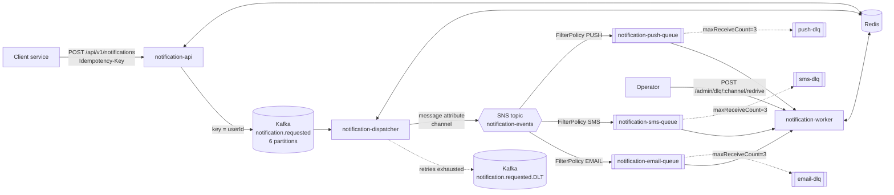
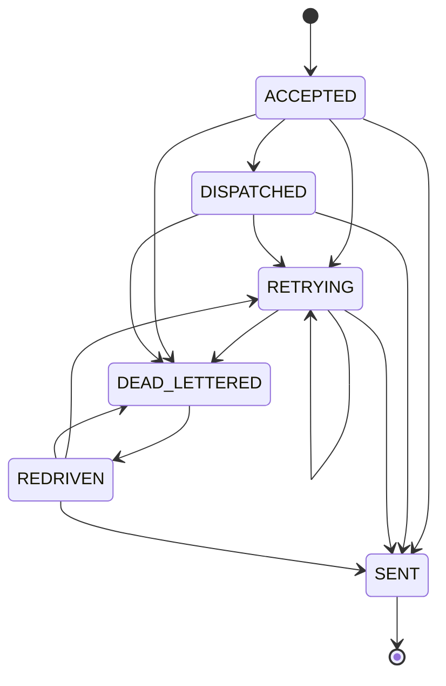

# Design Document — Distributed Notification Service

| | |
|---|---|
| **Status** | Implemented (v0.1) |
| **Author** | Huiying Sun |
| **Scope** | Asynchronous, multi-channel notification delivery with duplicate protection and failure recovery |

## 1. Problem

Product services (orders, auth, marketing …) need to notify users by email, SMS and push. Doing this
synchronously inside each service couples them to slow, unreliable third-party providers. A shared
notification platform should:

- accept a request quickly and deliver it asynchronously;
- survive crashes, redeliveries and provider outages **without losing notifications**;
- **never send the same notification twice** to a user, even though every messaging system involved
  is at-least-once;
- isolate failures per channel and give operators a way to recover failed messages.

### Goals

| # | Goal | How it is met |
|---|------|---------------|
| G1 | Asynchronous delivery across distributed services | Kafka ingestion log + SNS → SQS fan-out, three independent services |
| G2 | No duplicate delivery during reprocessing | Two-layer Redis idempotency (API key, delivery lease) |
| G3 | Transient failures are retried | Exponential backoff in dispatcher (Kafka) and worker (SQS visibility) |
| G4 | Permanent failures are isolated and recoverable | Per-channel SQS DLQs, Kafka DLT, redrive endpoint |
| G5 | Status is observable | Redis status record with a state machine + Micrometer counters |

### Non-goals (v0.1)

- Real provider integrations (SES, Twilio, FCM) — senders are mocks with fault injection.
- Templates, localization, user preferences, rate limiting.
- Strict global ordering after fan-out.
- Authentication on the API and admin endpoints.

## 2. Architecture



### 2.1 Why both Kafka and SNS/SQS?

They solve different problems:

- **Kafka** is the durable, replayable *ingestion log*. It absorbs bursts from producers, preserves
  per-user ordering (partition key = `userId`) and lets us replay history if a downstream bug is found.
- **SNS → SQS** is the *fan-out and work-queue* layer. SNS filter policies route by channel with zero
  code; SQS gives per-message visibility timeouts, per-message retries and native DLQs — exactly the
  primitives needed for delivery to unreliable providers. Kafka's partition-level offsets make
  per-message retry awkward (one slow message blocks its partition).

Adding a new channel means adding a queue + subscription + `ChannelSender`; the dispatcher does not change.

### 2.2 Services

| Service | Port | Input | Output | State |
|---|---|---|---|---|
| `notification-api` | 8080 | HTTP | Kafka `notification.requested` | Redis: API idempotency keys, initial status |
| `notification-dispatcher` | 8081 | Kafka | SNS `notification-events`, Kafka DLT | Redis: status → `DISPATCHED` / `DEAD_LETTERED` |
| `notification-worker` | 8082 | SQS ×3 | Channel senders | Redis: delivery leases, status → `SENT` / `RETRYING` / `DEAD_LETTERED` |

All services are stateless; horizontal scaling = more instances (Kafka consumer group and SQS
competing consumers distribute the work).

## 3. Data model

### 3.1 Event (Kafka value, SNS message, SQS body)

```json
{
  "notificationId": "9b2f…",          // UUID generated by the API — the delivery idempotency key
  "userId": "u-1001",                 // Kafka partition key
  "channel": "EMAIL",                 // EMAIL | SMS | PUSH — also an SNS message attribute
  "subject": "Welcome",
  "body": "Hello",
  "createdAt": "2026-09-24T18:00:00Z"
}
```

### 3.2 Redis keys (defined only in `RedisKeys`)

| Key | Type | Value | TTL | Written by |
|---|---|---|---|---|
| `notif:api-idem:{Idempotency-Key}` | string | `notificationId` | 24 h | API |
| `notif:delivery:{notificationId}` | string | `LEASE:{uuid}` or `DELIVERED` | 60 s lease / 7 d delivered | Worker |
| `notif:status:{notificationId}` | hash | `status, channel, userId, attempts, lastError, createdAt, updatedAt` | 7 d | All |

## 4. Delivery semantics

Every hop is **at-least-once**:

| Hop | Why duplicates can happen |
|---|---|
| Client → API | Client times out and retries |
| API → Kafka | Producer retry (mitigated by `enable.idempotence=true`) |
| Kafka → Dispatcher → SNS | Dispatcher publishes to SNS, crashes before committing the offset |
| SQS → Worker | SQS standard queues may deliver a message more than once; visibility timeout expiry |
| DLQ → source queue | Redrive crashes between send and delete |

Rather than trying to make each hop exactly-once, the system **deduplicates at the edges**:

1. **At the entrance** — the API maps `Idempotency-Key` → `notificationId` with `SET NX`.
   A replayed request returns `200 DUPLICATE_REQUEST` with the original id and publishes nothing.
2. **At the sink** — the worker allows exactly one successful delivery per `notificationId`.

Everything in between may duplicate freely. This keeps the dispatcher simple and stateless.

### 4.1 Delivery lease (worker)

```
             SET NX EX 60s                 send() ok
 (absent) ─────────────────► LEASE:{tok} ─────────────► DELIVERED (TTL 7d)
     ▲                            │
     └────── compare-and-delete ──┘  send() failed
```

```java
// IdempotencyGuard.tryAcquire
SET notif:delivery:{id} LEASE:{uuid} NX EX 60   → ACQUIRED
GET notif:delivery:{id} == "DELIVERED"          → ALREADY_DELIVERED  (ack and drop the copy)
otherwise                                       → IN_PROGRESS        (retry in 5 s)
```

Design points:

- **`SET NX` is atomic**, so among N concurrent copies exactly one proceeds.
- **The lease has a TTL** so a worker that crashes mid-send cannot block the notification forever.
- **Release is compare-and-delete in Lua** with a per-attempt token. Without the token, a slow worker
  whose lease already expired could delete a lease now held by another worker, allowing a third copy
  to send concurrently.
- **`DELIVERED` outlives the redelivery window** (7 days ≫ SQS retention for in-flight retries).

### 4.2 Residual risk

If a worker crashes *after* the provider accepted the message but *before* writing `DELIVERED`, the
lease expires and the notification is sent again. No distributed system can close this gap without
provider cooperation; the production fix is to pass `notificationId` as the provider's idempotency
key (supported by SES, Twilio, FCM message IDs). The window is milliseconds wide.

## 5. Retry strategy

| Stage | Mechanism | Schedule | Exhaustion |
|---|---|---|---|
| Dispatcher | Spring Kafka `DefaultErrorHandler` + `ExponentialBackOffWithMaxRetries` | 1 s, 2 s, 4 s (in-process, blocks the partition) | `DeadLetterPublishingRecoverer` → `<topic>.DLT`, offset committed |
| Worker | Throw → message stays on queue; `Visibility.changeTo(delay)` | 2 s, 4 s, 8 s … capped at 60 s, +≤20 % jitter | SQS `RedrivePolicy` moves to channel DLQ after 3 receives |

- Non-retryable errors (malformed JSON, missing fields) skip retries: the dispatcher routes them straight
  to the DLT; the worker sets visibility to 0 so the message burns through its receives immediately.
- Jitter prevents synchronized retry storms when a provider recovers.
- Worker retry state lives **in SQS** (the receive count), not in the worker, so any instance can pick up
  the next attempt.
- `app.worker.max-receive-count` must equal the queue's `maxReceiveCount` so the worker knows which
  attempt is the last one and can mark the status `DEAD_LETTERED`.

## 6. Failure isolation and recovery

- **One DLQ per channel.** An SMS provider outage fills `sms-dlq` only; email and push keep flowing.
- **DLQ retention is 14 days**, giving operators time to fix root causes.
- **Redrive** (`POST /admin/dlq/{channel}/redrive?max=N`): receive from DLQ → send to source queue →
  delete from DLQ. Send-before-delete means a crash yields a duplicate (absorbed by the delivery lease),
  never a loss. Redriven messages get a fresh receive count, i.e. a full new retry budget.
- **Dispatch-stage failures** land in the Kafka DLT; `DeadLetterConsumer` marks them `DEAD_LETTERED`
  with the root-cause message so they are visible through the status API.

### Failure scenarios

| Scenario | Behavior |
|---|---|
| Client retries after timeout | Same `notificationId` returned, nothing re-published |
| Kafka unavailable when API publishes | 503; status and idempotency key rolled back so the client can retry with the same key |
| Dispatcher crashes after SNS publish, before offset commit | Event re-published; worker suppresses duplicate (`outcome=duplicate`) |
| SNS publish throttled | Retried 1 s/2 s/4 s; then Kafka DLT, status `DEAD_LETTERED` |
| Provider timeout (transient) | Status `RETRYING`, backoff, usually `SENT` on attempt 2–3 |
| Provider permanently rejects | 3 attempts → channel DLQ, status `DEAD_LETTERED`, `lastError` set |
| Worker crashes mid-send | Lease expires (60 s), message reappears after visibility timeout, another worker retries |
| Same message consumed by two workers concurrently | One gets the lease; the other sees `IN_PROGRESS` and retries later, then sees `DELIVERED` |
| Redis unavailable | Worker cannot acquire leases → messages retried → DLQ if prolonged. Chosen over sending without dedup (fail closed). |

## 7. Status state machine



The dispatcher and worker update the same record concurrently. The worker can deliver *before* the
dispatcher records `DISPATCHED` (SNS/SQS are fast). A naive `HSET` would move the record from `SENT`
back to `DISPATCHED`. Instead, `NotificationStatusStore.transition` runs a Lua script that applies the
update only if the current status is one of the target's allowed predecessors
(`NotificationStatus.allowedPredecessors()`), making each transition an atomic compare-and-set.

## 8. Observability

- `GET /api/v1/notifications/{id}` — current status, attempts, last error.
- `notification.delivery{channel, outcome}` counter on the worker
  (`outcome` ∈ `sent, duplicate, in_progress, retry, dead_lettered, malformed`), exposed at
  `/actuator/metrics/notification.delivery`.
- `GET /admin/dlq/{channel}` — DLQ depth and in-flight count.
- Structured log lines include `notificationId` at every stage for grep-based tracing.

## 9. Scaling notes

- **API**: stateless, scale behind a load balancer. Redis `SET NX` is O(1).
- **Dispatcher**: parallelism = number of Kafka partitions (6). Increase partitions to scale further.
  Blocking retries pause one partition at a time, bounded by ~7 s.
- **Worker**: SQS competing consumers; scale instances and `max-concurrent-messages` independently of
  Kafka. Per-channel queues allow per-channel scaling (e.g. more SMS workers).
- **Redis**: keys are independent, so the layout shards cleanly under Redis Cluster.

## 10. Alternatives considered

| Option | Why not (for v0.1) |
|---|---|
| Kafka only (retry topics instead of SQS) | Works, but needs a retry-topic per delay tier and custom DLQ tooling; SQS gives visibility timeouts and redrive natively. |
| SQS only (no Kafka) | Loses the replayable log and per-user ordering at ingestion. |
| SQS FIFO with deduplication ID | 5-minute dedup window only, lower throughput; still needs sink-side idempotency for redrives. |
| Database table for idempotency | Durable, but adds latency and a hot write path; Redis TTLs match the lifetime of the data. A DB would be the choice if dedup had to survive a Redis flush. |
| Kafka transactions / exactly-once | Only covers Kafka-to-Kafka; the side effect (sending an SMS) is outside the transaction. |

## 11. Future work

- Testcontainers-based integration tests in the Maven build.
- Load testing (k6/Gatling) to publish throughput, P99 latency and duplicate-rate numbers.
- Transactional outbox once the API persists notifications in a database.
- Provider-side idempotency keys; per-user rate limiting; templates and preferences.
- CDK stack for real AWS deployment (including the SQS queue policy that authorizes SNS).
